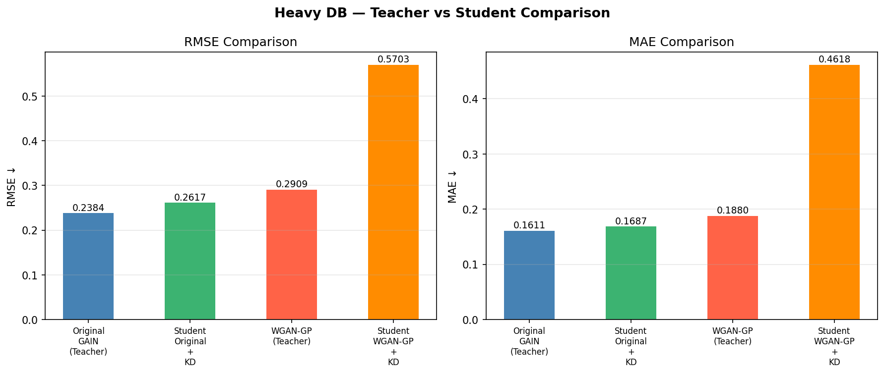
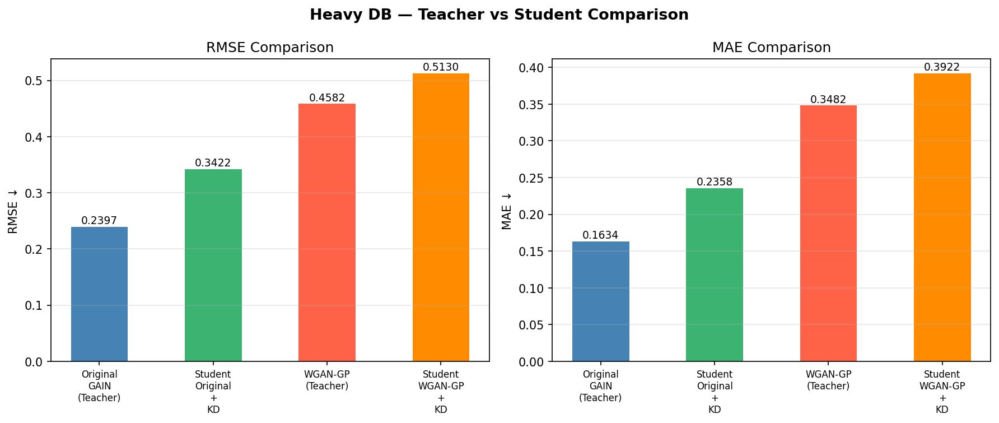
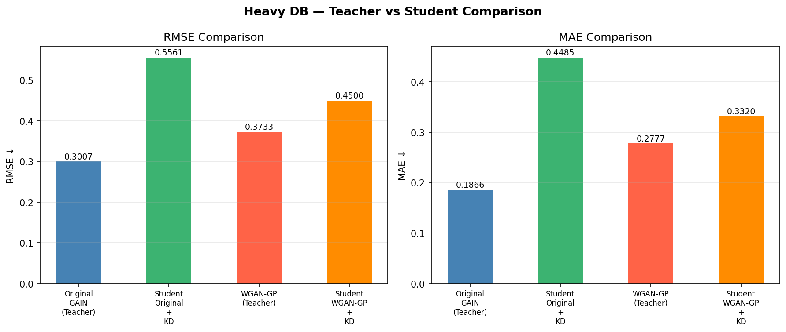
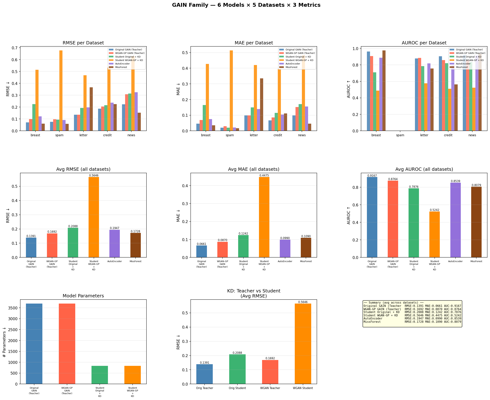
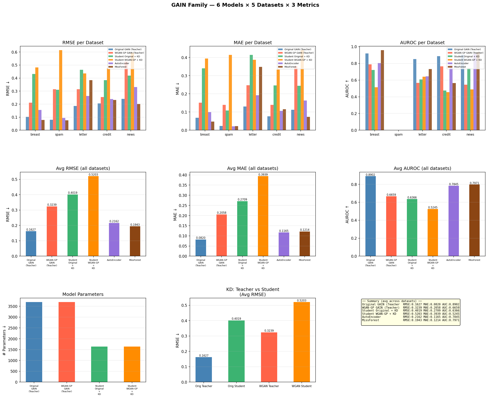
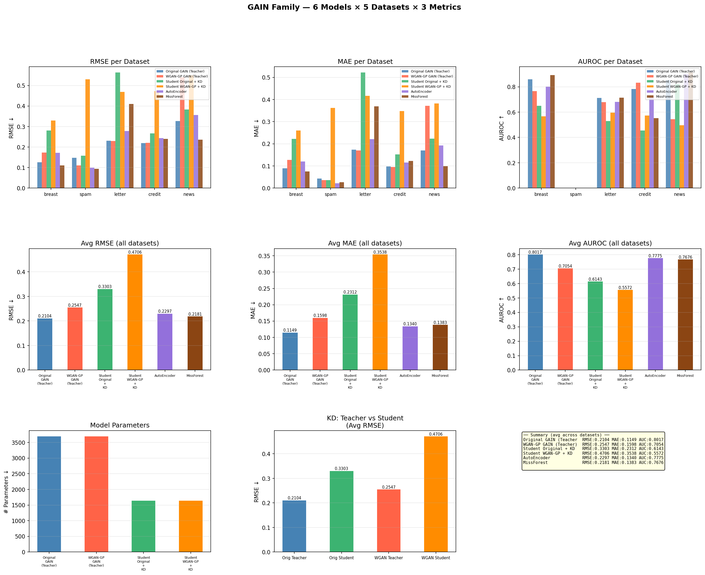

# Light-Weight GAIN with Knowledge Distillation

this code is written for rearrange GAIN code based on PyTorch.

Original code is from here(https://github.com/jsyoon0823/GAIN/tree/master) which is author of GAIN's github page.

You can download original paper[1] below here(https://arxiv.org/abs/1806.02920).

---
### BASIC INFORMATION
- Written by: jay 7531 (https://github.com/jay7531)
- Date: 2026.04.06. - current

### ABSTRACT
본 실습은 2026년 1학기 '데이터 사이언스 특강' 수업의 term project 일환으로 구상된 light-weight GAIN 개발 과정을 담은 코드이다.

기존의 GAIN에 knowledge distillation(이하 KD)를 적용해 모델의 무게를 줄이고, Wsserstein Loss를 통해 학습 안정성을 강화한 light-weight GAIN을 설계해보고자 하였다.

### Dataset and Experiment Setting
- Dataset: same database with GAIN paper
'spam'  : 'https://archive.ics.uci.edu/ml/machine-learning-databases/spambase/spambase.data',
'letter': 'https://archive.ics.uci.edu/ml/machine-learning-databases/letter-recognition/letter-recognition.data',
'credit': 'https://archive.ics.uci.edu/ml/machine-learning-databases/00350/default%20of%20credit%20card%20clients.xls',
'breast': 'https://archive.ics.uci.edu/ml/machine-learning-databases/breast-cancer-wisconsin/wdbc.data',
'news'  : 'https://archive.ics.uci.edu/ml/machine-learning-databases/00332/OnlineNewsPopularity.zip',
- Path: ./data
- Requirements: I already put in 'requirements.txt' in this project. So please operate "pip install -r requirements.txt" in your local terminal to make sure fundamental setting is ready.

### Experiment
- **Models Used:** 6 Models
  - Original GAIN (Teacher / Student)
  - WGAN-GP GAIN (Teacher / Student)
  - Autoencoder
  - MissForest
- **Datasets:** Breast, Spam, Letter, Credit, News
- **Evaluation Metrics:** RMSE, MAE, AUROC

### Process and Result
- 2026.04.06. GAIN 원본 코드 다운 및 성능 확인, Wasserstein Loss 적용 및 성능 비교. Fig 1
- 2026.04.07. Knowledge Distillation 적용 및 성능 비교, Tunning(critic 개선, alpha 수정). Fig 2-4
- 2026.04.09. GAIN 원본 논문을 참조하여 데이터셋과 비교용 classic imputation method(Auto Encoder, MissForest)를 추가. Fig 5-6
- 2026.04.10. 조금 더 큰 데이터셋과 다양한 결측치를 시도해볼 때 light-weight GAIN의 성능이 두드러질 것으로 판단. HIGGS와 Criteo라는 대형 데이터셋 추가 및 다양한 결측 확률(20, 50, 80%)에 대해서 실혐 진행. Fig 7
-             동일한 설정을 이전에 사용한 light DB에 대해서도 동작. Fig 8.

Fig 1.

Fig 2. (a)

Fig 2. (b)

Fig 3. (a)

Fig 3. (b)

Fig 4. (a)

Fig 4. (b)

Fig 5. (a)

Fig 5. (b)

Fig 5. (c)

Fig 6.

Fig 7. (a)

Fig 7. (b)

Fig 7. (c)

Fig 8. (a)

Fig 8. (b)

Fig 8. (c)

### Reference
[1] Jinsung Yoon, James Jordon and Mihaela van der Schaar, "GAIN: Missing Data Imputation using Generative Adversarial Nets", ICML 2018, [Online] available https://arxiv.org/abs/1806.02920
