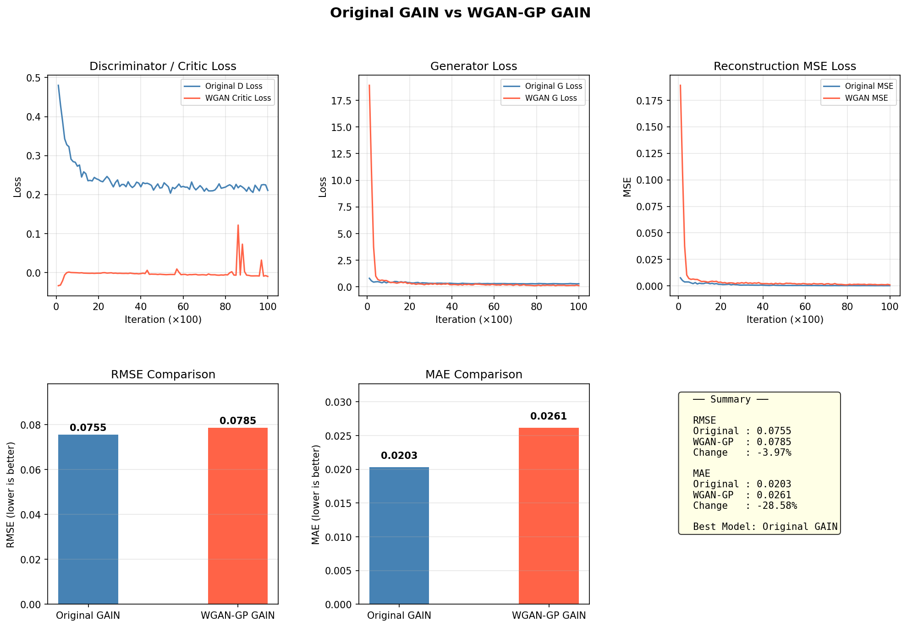
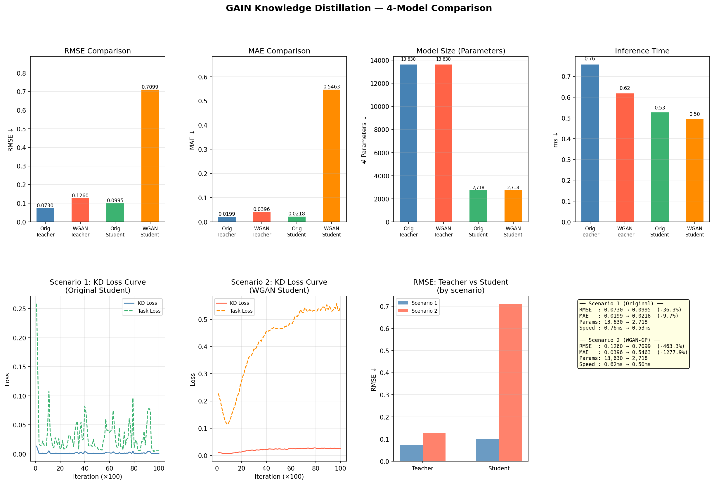
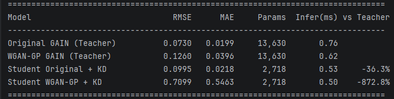
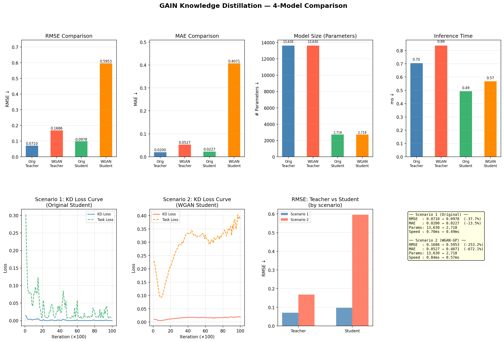
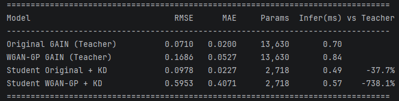
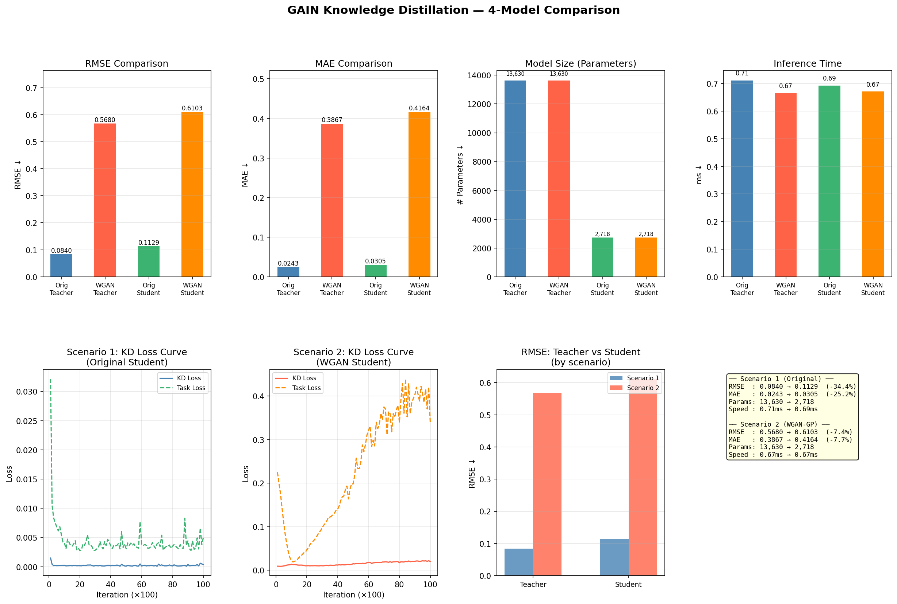
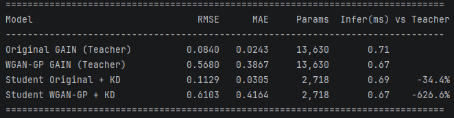
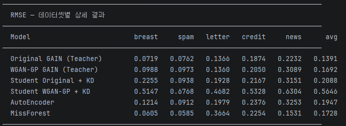
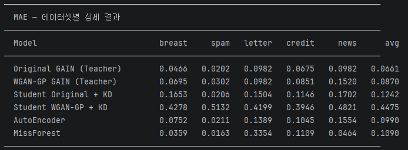
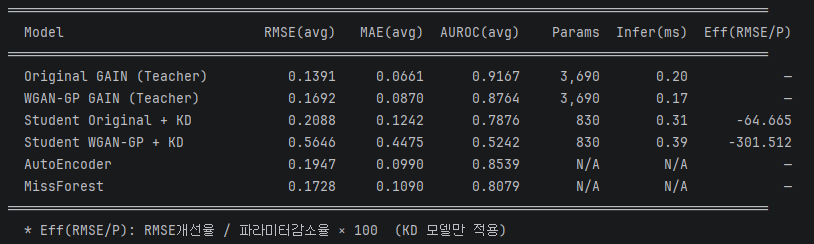

# Light-Weight GAIN with Knowledge Distillation

this code is written for rearrange GAIN code based on PyTorch.

Original code is from here(https://github.com/jsyoon0823/GAIN/tree/master) which is author of GAIN's github page.

You can download original paper[1] below here(https://arxiv.org/abs/1806.02920).

---
### BASIC INFORMATION
- Written by: jay 7531 (https://github.com/jay7531)
- Date: 2026.04.06. - current

### ABSTRACT
본 실습은 2026년 1학기 '데이터 사이언스 특강' 수업의 term project 일환으로 구상된 light-weight GAIN 개발 과정을 담은 코드이다.

기존의 GAIN에 knowledge distillation(이하 KD)를 적용해 모델의 무게를 줄이고, Wsserstein Loss를 통해 학습 안정성을 강화한 light-weight GAIN을 설계해보고자 하였다.

### Dataset and Experiment Setting
- Dataset: same database with GAIN paper
'spam'  : 'https://archive.ics.uci.edu/ml/machine-learning-databases/spambase/spambase.data',
'letter': 'https://archive.ics.uci.edu/ml/machine-learning-databases/letter-recognition/letter-recognition.data',
'credit': 'https://archive.ics.uci.edu/ml/machine-learning-databases/00350/default%20of%20credit%20card%20clients.xls',
'breast': 'https://archive.ics.uci.edu/ml/machine-learning-databases/breast-cancer-wisconsin/wdbc.data',
'news'  : 'https://archive.ics.uci.edu/ml/machine-learning-databases/00332/OnlineNewsPopularity.zip',
- Path: ./data
- Requirements: I already put in 'requirements.txt' in this project. So please operate "pip install -r requirements.txt" in your local terminal to make sure fundamental setting is ready.

### Experiment
- **Models Used:** 6 Models
  - Original GAIN (Teacher / Student)
  - WGAN-GP GAIN (Teacher / Student)
  - Autoencoder
  - MissForest
- **Datasets:** Breast, Spam, Letter, Credit, News
- **Evaluation Metrics:** RMSE, MAE, AUROC

### Process and Result
- 2026.04.06. GAIN 원본 코드 다운 및 성능 확인, Wasserstein Loss 적용 및 성능 비교. Fig 1
- 2026.04.07. Knowledge Distillation 적용 및 성능 비교, Tunning(critic 개선, alpha 수정). Fig 2-4
- 2026.04.09. GAIN 원본 논문을 참조하여 데이터셋과 비교용 classic imputation method(Auto Encoder, MissForest)를 추가. Fig 5

### Reference
[1] Jinsung Yoon, James Jordon and Mihaela van der Schaar, "GAIN: Missing Data Imputation using Generative Adversarial Nets", ICML 2018, [Online] available https://arxiv.org/abs/1806.02920
